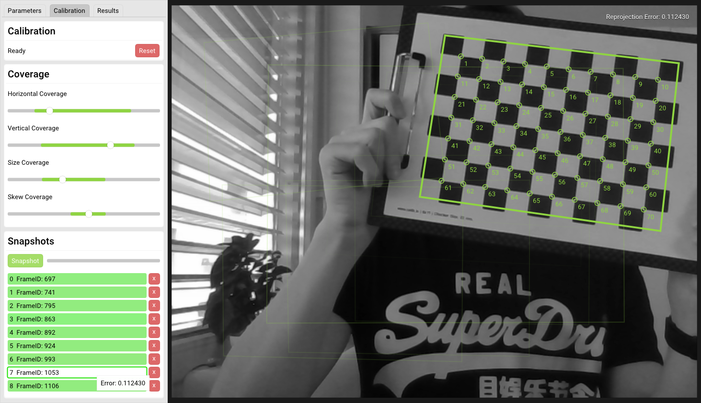

# ccalib

## Overview

ccalib is a simple and easy to use GUI for (currently) monocular intrinsic camera calibration.
It let's you stream directly from your webcam (or any uvc / v4l2 device) without the need to have a separate app
or ROS-node to publish images first (the camera needs to be mountable as /dev/video).



The app provides intuitive instructions to take snapshots for calibration in an automatic fashion as well as offers
the possibility to manually take additional snapshots for refinement. It shows camera parameter coverage and 
also re-projection error for every single frame that has been taken.

Results can easily be exported in YAML format.

## Compability

For now this has only been developed and tested for Ubuntu 18.04+

## Installation

### Dependencies

This app relies on OpenCV implementation of checkerboard detection and camera calibration and OpenGL + SDL
for the rendering of the GUI. So make sure you have these libraries installed:

```
OpenGL
SDL2
OpenCV 3+
```

### Building

Clone the repository to your local machine with all dependencies resolved. For convenience just type:

```
https://github.com/andy2804/ccalib.git
```

Navigate to the folder and create a new build subdirectory and navigate there:

```
mkdir build && cd build
```

Create the makefiles:

```
cmake ../
```

Finally, build the project (substitue n with the # of cpu cores):

```
make -j n
```